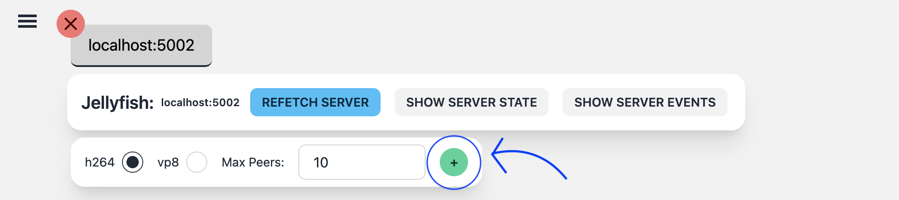
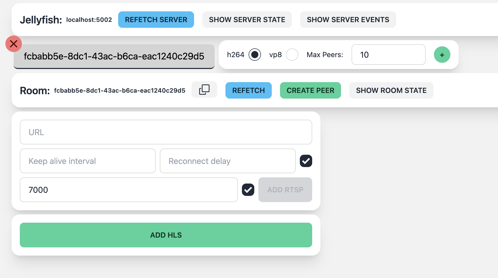
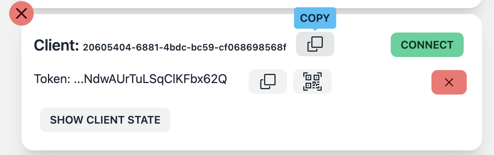
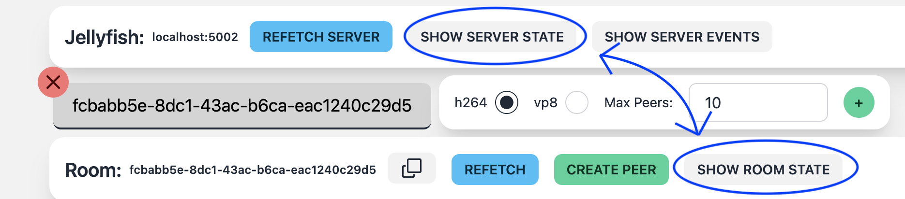

import JellyfishArchitecture from "./_jellyfish-architecture.mdx";
import StartingJellyfishBackend from "./_starting-jellyfish-backend.mdx";
import StartingJellyfishDashboard from "./_starting-dashboard.mdx";

# The Whats and Hows of Jellyfish Dashboard

## What is Jellyfish Dashboard?

Jellyfish dashboard is a web application that allows you to manage your
Jellyfish backend. It is a React application that uses the Jellyfish React Client API
to communicate with the backend.

It was created to help Jellyfish developers in testing, but was later extended and
adapted to be used in tutorials and demos. Here we present a short introduction to
the dashboard and its features.

## How to start Jellyfish Dashboard?

<StartingJellyfishDashboard />

## How to start Jellyfish Backend?

<StartingJellyfishBackend />

## How to use Jellyfish Dashboard?

Since we have Dashboard and Jellyfish backend up and running, we can dive into
the features.

### Connecting to the server

We started the dashboard and the backend separately, so we need to connect them.

1. Open the dashboard in your browser. Open the side menu and fill in the parameters:
   

- **Server token** - token that is used to authenticate the dashboard with the backend. For now it's simply `development`, but
  it is meant to be used to authenticate the dashboard with the backend.
- **WS/WSS** - whether to use secure or insecure connection. For now it's `ws`, but if backend uses secure WebSocket, use `wss`.
- **HTTP/HTTPS** - whether to use secure or insecure connection. For now it's `http`, but if backend uses secure HTTP, use `https`.
- **Server URL** - URL of the backend server. For example `localhost:5002` would be local build, but it can be any URL that points to the backend.
- **Socket Path** - path to the WebSocket endpoint. Default value is `/socket/peer/websocket`.

2. Click **Connect to server**. If everything is correct, a server will appear in the list of connected servers:
   

### Creating a room

There are plenty of settings that can be configured for a room:

- **vp8 or h264** - video codec used in the room. If you want to use `HLS` streaming, you need to use `h264`.
- **Max Peers** - maximum number of peers that can be connected to the room.

When you select the settings, click the **Add room** button. If everything is correct, a room will appear in the list of rooms:

### Adding and connecting peers to the room

Using the **Create peer** button, you can create a peer that will be ready to connect to the room.

The peer has its `ID` and `Token`. The `ID` is used to identify the peer in the backend, and the `Token` is used to authenticate the peer with the backend.

Dashboard has an option to copy both of those values to the clipboard. You can also create a QR code with the peer's `Token` that can be scanned to connect to Jellyfish with a mobile device.

To connect the peer to the room, you can either press the **Connect** button in the peer's row, or scan the QR code with your mobile app, and connect there.

### Sending tracks

When the peer is connected to the room, you will see the track menu. It allows you to send tracks to the room.

You can select the audio or video tracks that you want to send to the room. Apart from your camera/microphone,
you can also select from a list of mock tracks that we prepared.

You can also select the resolution of the video track
and if you want, you can send the video as a simulcast stream.

There is also an option to add custom metadata (in JSON format) to the track. This metadata will be sent to the room and each recipient will be able to see it.

When you select the track, click the **Add track** button. If everything is correct, the tracks will be sent to the room and other peers
will be able to see and hear you.

### Receiving tracks

When the peer is connected to the room, you will automatically recieve tracks from other peers.

#### Congrats! The basic utils of the dashboard are now covered. Next, we will dive into useful features that can be used for testing.

## A ton of information that dashboard provides

### Server logs in console

On the side menu, you can set up the dashboard to show the server logs in the console.
This is useful for debugging purposes and presents the variety of communication that happens between the dashboard and the backend.
You can also regiser your own callbacks in your Jellyfish projects.

### Server/Room/Client state

Each server, room and client has its own state. You can see the state of each of them in the dashboard, clicking appropriate buttons.

### Server events

Apart from the state, you can also see the events that happen on the server.
You can see them after clicking the **Show Server Events** button.

## HLS and RTSP streaming

Dashboard allows adding HLS and RTSP streams in the room. You can set up the streams and see them in the room. like this:

# Congrats! You now know how to use Jellyfish Dashboard!

You want to explore more? Try out our tutorials and demos!
